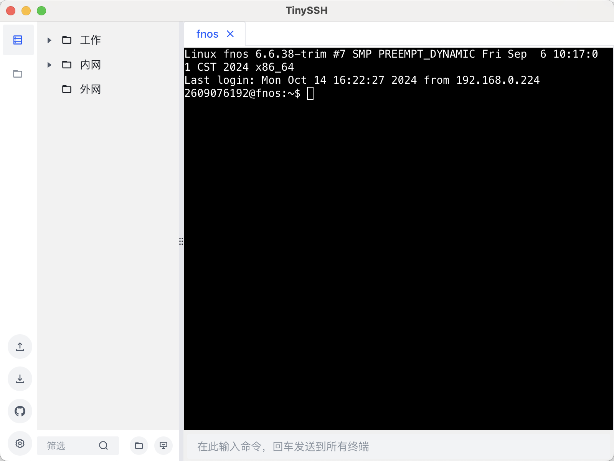
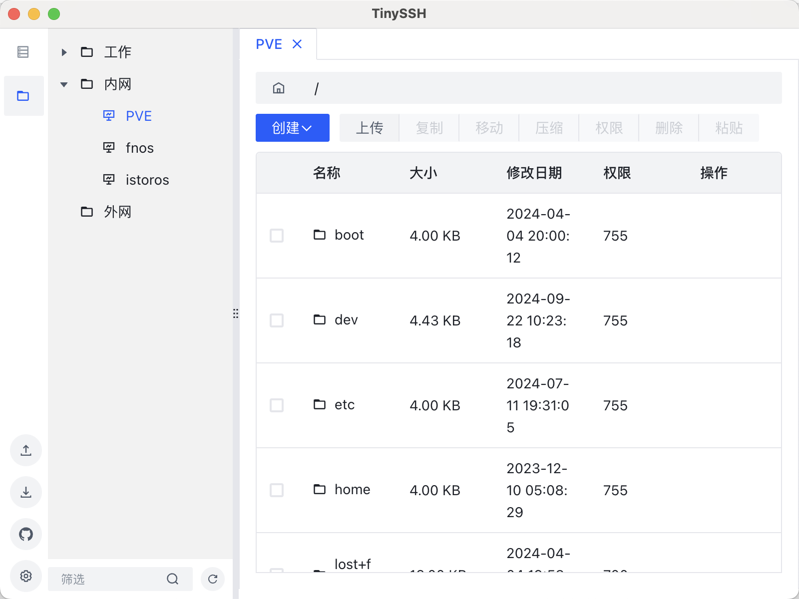
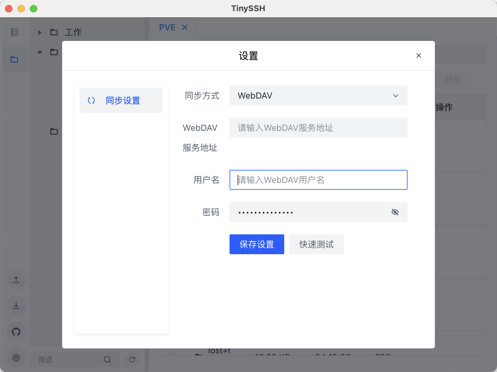

# 🚀 TinySSH

## 🌟 简介

TinySSH 是一款功能强大、高效的 SSH 客户端工具，为开发者和系统管理员提供便捷、安全的远程服务器管理体验。它结合了简洁的界面设计和丰富的功能，让您的远程操作更加轻松自如。

## ✨ 特性

<table>
  <tr>
    <td>🔐 安全可靠的 SSH 连接</td>
    <td>🖥️ 直观友好的用户界面</td>
  </tr>
  <tr>
    <td>📁 文件夹式管理多个 SSH 连接</td>
    <td>🚄 快速连接和断开</td>
  </tr>
  <tr>
    <td>☁️ 支持 WebDAV 和 S3 对象存储同步</td>
    <td>📤 SFTP 文件上传功能</td>
  </tr>
  <tr>
    <td>🗜️ 在线文件压缩和解压</td>
    <td>📋 文件复制粘贴操作</td>
  </tr>
  <tr>
    <td>🌈 自定义终端主题（开发中）</td>
    <td>🔍 更多特性持续开发中…</td>
  </tr>
</table>

## 📸 预览

  
  
  

